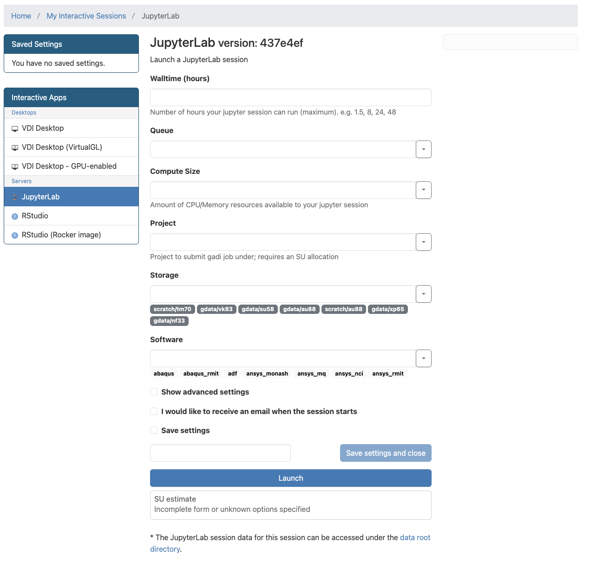
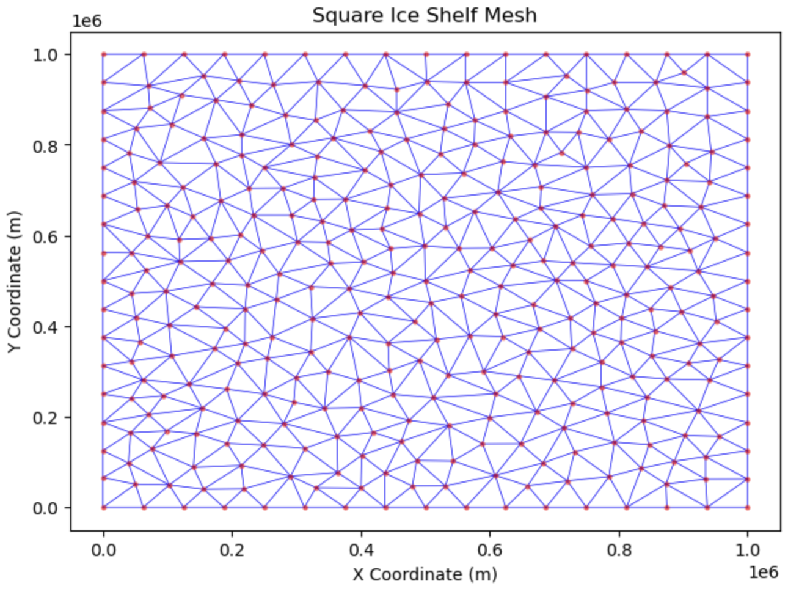
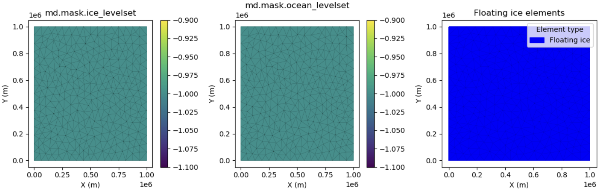
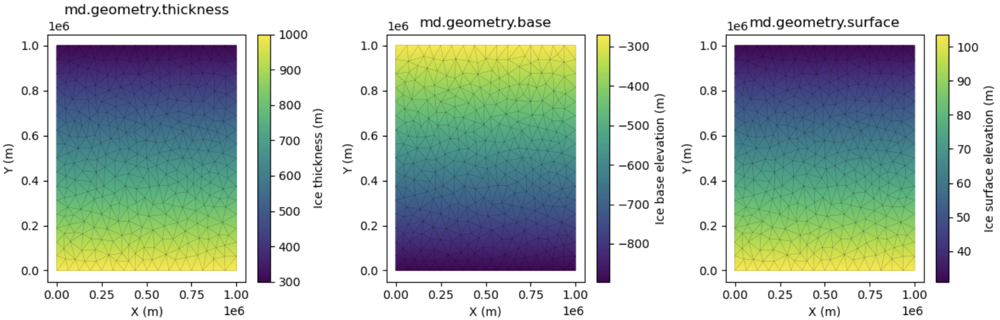
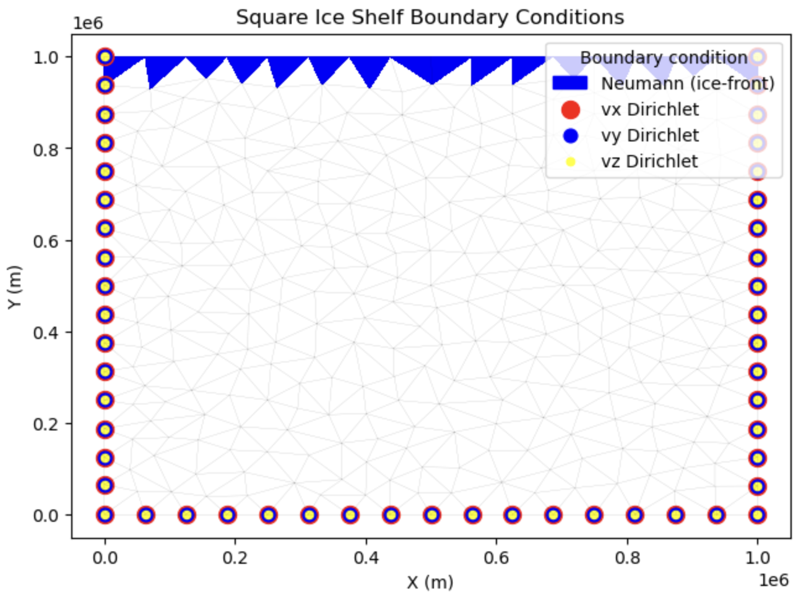
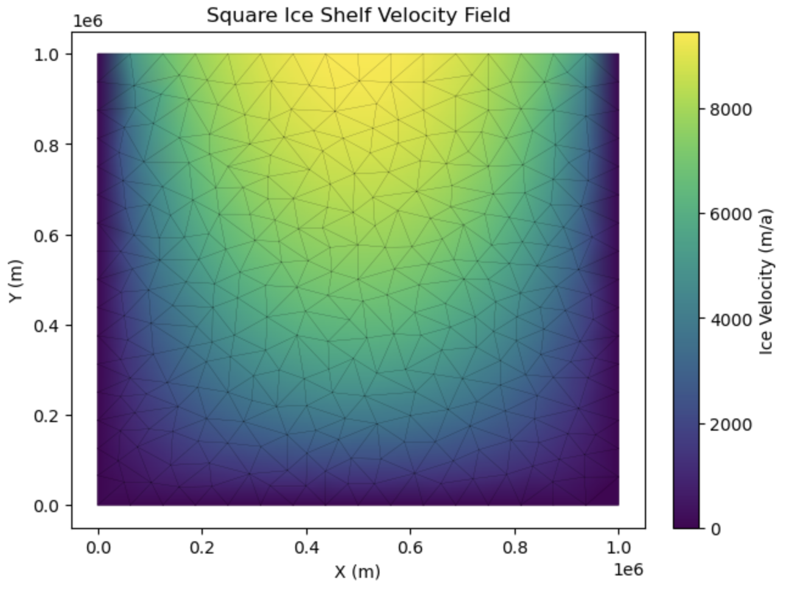





!!! release
    This is a Beta Release.
    Any model configuration and related source code mentioned in this page might change before the full release.
    Limited support is currently provided for this model. Its usage is only recommended for testing by experienced users and collaborators.

# Run {{ model }}

## About

ACCESS-ISSM is the Ice-sheet and Sea-level System Model (ISSM) maintained by ACCESS-NRI. Hosted on the [NCI _Gadi_ supercomputer](https://opus.nci.org.au/spaces/Help/pages/90308778/0.+Welcome+to+Gadi#id-0.WelcometoGadi-Overview), ACCESS-ISSM makes centrally-managed ISSM executables available to the Australian ice sheet modelling community. ACCESS-ISSM is being used to integrate ISSM into the ACCESS climate modelling framework, with development of [ACCESS-AIS3](https://github.com/ACCESS-NRI/ACCESS-AIS3), a whole-Antarctic ISSM configuration.

While ACCESS-ISSM provides centrally-managed model executables, [pyISSM](https://github.com/ACCESS-NRI/pyISSM) is used to develop model configurations and for model execution on [NCI _Gadi_](https://opus.nci.org.au/spaces/Help/pages/90308778/0.+Welcome+to+Gadi#id-0.WelcometoGadi-Overview). [pyISSM](https://github.com/ACCESS-NRI/pyISSM) is the Python API for ISSM, developed and managed by ACCESS-NRI. [pyISSM](https://github.com/ACCESS-NRI/pyISSM) contains various [Tutorials](https://pyissm.readthedocs.io/latest/tutorials.html) for using pyISSM.

Here, we provide guidance on getting started with pyISSM and ACCESS-ISSM on [NCI _Gadi_](https://opus.nci.org.au/spaces/Help/pages/90308778/0.+Welcome+to+Gadi#id-0.WelcometoGadi-Overview). We provide step-by-step instructions on how to initialise an appropriate [Australian Research Environment (ARE)](https://docs.access-hive.org.au/getting_started/are/#jupyterlab) session on [NCI _Gadi_](https://opus.nci.org.au/spaces/Help/pages/90308778/0.+Welcome+to+Gadi#id-0.WelcometoGadi-Overview), install pyISSM, and execute the simple ["Square Ice Shelf" pyISSM tutorial](https://pyissm.readthedocs.io/latest/tutorials/ex1_SquareIceShelf.html)

## Prerequisites

!!! warning
    To run {{ model }}, you need to be a member of a project with allocated _Service Units (SU)_. For more information, check [how to join relevant NCI projects](/getting_started/set_up_nci_account#join-relevant-nci-projects).

- **NCI Account**<br>
    Before running {{ model }}, you need to [Set Up your NCI Account](/getting_started/set_up_nci_account).

- **Join NCI projects**<br>
    Join the following projects by requesting membership on their respective NCI project pages:

    - [vk83](https://my.nci.org.au/mancini/project/vk83/join) - required to access ACCESS-ISSM executables
    - [xp65](https://my.nci.org.au/mancini/project/xp65/join) - required to access the ACCESS-NRI managed Conda environment containing all pyISSM dependencies

  For more information on joining specific NCI projects, refer to [How to connect to a project](https://opus.nci.org.au/display/Help/How+to+connect+to+a+project).

## Getting started

### Setting up your ARE JupyterLab Session
All pyISSM tutorials are presented as Jupyter Notebooks and can be executed easily using an [ARE JupyterLab session](https://docs.access-hive.org.au/getting_started/are/#jupyterlab). To start an appropriate ARE JupyterLab session go to the [ARE JupyterLab](https://are.nci.org.au/pun/sys/dashboard/batch_connect/sys/jupyter/ncigadi/session_contexts/new) page and follow these steps:

- Step 1:
    - Log in with your NCI Username and password. You'll be presented with a new JupyterLab session configuration, similar to the one shown below.

    

- Step 2:
    - Configure the ARE JupyterLab session with the required fields. The following entries are recommended for this simple tutorial and can be cusomtised as necessary for larger model simulations.

        - Walltime (hours): `1`
        - Queue: `normalbw`
        - Compute Size: `small`
        - Project: `<USER SELECTED PROJECT>`
        - Storage:  `gdata/xp65+gdata/vk83`

    !!! warning
        Note that the `Project` field will vary depending on your chosen project with allocated Service Units. 

    - Click on "Show advanced settings" and enter the following field entries:
        - Module directories: `/g/data/vk83/modules /g/data/xp65/public/modules`
        - Modules: `conda/analysis3 access-issm/2025.11.0`

- Step 3:
    - Click on the _Launch_ button to launch the session. You will be prompted to your Interactive Sessions page and you will see your last requested session at the top.
    - Wait until your session starts and then click on the _Open JupyterLab_ button to open a new tab with the JupyterLab interface. Inside the JupyterLab interface, you can open a new Terminal instance in the Launcher panel by scrolling down and selecting "Terminal". Click on the plus button next to your current tab in the JupyterLab interface to open a new Launcher panel.

### Setup environment requirements

Interacting with {{ model }} requires the `$ISSM_DIR` environment variable be set to use an appropriate executable. This is handled automatically when loading the {{ model }} module on _Gadi_. To set these variables in preparation for running an ISSM model, run the following code block in your Terminal tab:

```bash
module use /g/data/vk83/modules
module load access-issm/2025.11.0
```

In addition, to prevent the need for all users to maintain individual Python environments, we can leverage the `conda/analysis3` environment maintained by ACCESS-NRI. To load the Python environment, run the following code block in your Terminal tab:

```bash
module use /g/data/xp65/public/modules
module load conda/analysis3
```

### Installing pyISSM
Since [pyISSM](https://github.com/ACCESS-NRI/pyISSM) is actively being developed, we recommend installing the latest development version directly from Github.

!!! warning
    These instructions install pyISSM into your `$HOME` directory on NCI _Gadi_. You may adjust the installation location if you prefer.

To install pyISSM, simply run the following in a new Terminal (accessed from the JupyterLab Launcher panel):
```bash
cd ~
git clone https://github.com/ACCESS-NRI/pyISSM.git
cd pyISSM
pip install .
```

The installation may take a few minutes. Once the installation completes successfully, you will see `Successfully installed pyissm-...`.

### Run the "Square Ice Shelf" Tutorial
You're now ready to get started with pyISSM and execute your first ISSM model using ACCESS-ISSM! 

!!! info
    We recommend working through this tutorial directly in the `~/pyISSM/tutorials/ex1_SquuareIceShelf.ipynb` file, where more detailed explainations of the different modelling steps are provided. Use the file explorer of your ARE JupyterLab Session to navigate to and open the file.

Below, we provide only the code blocks taken directly from the tutorial notebook for brevity.

!!! info
    Code blocks below are formatted such that the output generated by the code block is indented, as follows:
    ```python
    Code here
    ```
    > ```
    > Output here
    > ```


#### Import required Python modules
Import pyISSM and other required Python modules as follows:

```python
import os
import pyissm
import numpy as np
from pathlib import Path
import matplotlib.pyplot as plt
```

#### Configure your modelling environment
By default, the Square Ice Shelf tutorial is designed to be executed on NCI _Gadi_. To ensure your modelling environment is configured correctly, execute the following cell:

```python
## Set required paths
tutorial_dir = str(Path.home() / 'pyISSM' / 'tutorials')
asset_dir = tutorial_dir + '/assets'
execution_dir = tutorial_dir + '/models'

# Check that execution directory exists. If not, create it
if not os.path.isdir(execution_dir):
    os.mkdir(execution_dir)

# Print the paths for visibility
print(f"The following `tutorial_dir` is set: {tutorial_dir}")
print(f"The following `asset_dir` is set: {asset_dir}")
print(f"The following `execution_dir` is set: {execution_dir}")
```

If pyISSM was installed in your `$HOME` directory (as described above), you should see an output like this:

> ```
> The following `tutorial_dir` is set: `~/home/<CODE>/<USER>/pyISSM/tutorials`
> The following `asset_dir` is set: `/home/<CODE>/<USER>/pyISSM/tutorials/assets`
> The following `execution_dir` is set: `/home/<CODE>/<USER>/pyISSM/tutorials/models`
> ```

where `<CODE>` is your NCI _Gadi_ group code and `<USER>` is your NCI username.

#### Initialise an empty model
To begin building an ISSM model, we first initialise an empty model. For more information about the `md` object, refer to the [Introduction to pyISSM tutorial](https://github.com/ACCESS-NRI/pyISSM/blob/main/tutorials/1_pyISSM_intro.ipynb).

```python
# Create an empty model
md = pyissm.model.Model()

# Inspect the empty model
md
```

Inspecting the empty ISSM model object (`md`) will provide an overview of all available model fields

> ```
> ISSM Model Class                         
>                                             
>               mesh:  mesh properties         
>               mask:  defines grounded and floating elements 
>           geometry:  surface elevation, bedrock topography, ice thickness, ... 
>          constants:  physical constants      
>                smb:  surface mass balance    
>      basalforcings:  bed forcings            
>          materials:  material properties     
>             damage:  damage propagation laws 
>           friction:  basal friction / drag properties 
>       flowequation:  flow equations          
>       timestepping:  timestepping for transient models 
>     initialization:  initial guess / state   
>              rifts:  rifts properties        
>         solidearth:  solidearth inputs and settings 
>                dsl:  dynamic sea level       
>              debug:  debugging tools (valgrind, gprof 
>            verbose:  verbosity level in solve 
>           settings:  settings properties     
>           toolkits:  PETSc options for each solution 
>            cluster:  cluster parameters (number of CPUs...) 
>   balancethickness:  parameters for balancethickness solution 
>      stressbalance:  parameters for stressbalance solution 
>      groundingline:  parameters for groundingline solution 
>          hydrology:  parameters for hydrology solution 
>      masstransport:  parameters for masstransport solution 
>            thermal:  parameters for thermal solution 
>        steadystate:  parameters for steadystate solution 
>          transient:  parameters for transient solution 
>           levelset:  parameters for moving boundaries (level-set method) 
>            calving:  parameters for calving  
>    frontalforcings:  parameters for frontalforcings 
>                esa:  parameters for elastic adjustment solution 
>           sampling:  parameters for stochastic sampler 
>               love:  parameters for love solution 
>           autodiff:  automatic differentiation parameters 
>          inversion:  parameters for inverse methods 
>                qmu:  Dakota properties       
>                amr:  adaptive mesh refinement properties 
>   outputdefinition:  output definition       
>            results:  model results           
>       radaroverlay:  radar image for plot overlay 
>      miscellaneous:  miscellaneous fields    
>  stochasticforcing:  stochasticity applied to model forcings 
> ```


#### Create a model mesh
The first step when building any ISSM model is to generate a model mesh. This contains the information onto which all model fields and parameters are stored. Here, we use an `*.exp` file to define the outline of our model domain and generate a triangular mesh with a resolution of 50 km.

```python
# Build a model mesh using the domain outline (SquareShelf_DomainOutline.exp) with a resolution of 50 km.
md = pyissm.model.mesh.triangle(md,
                                domain_name = asset_dir + '/Exp/SquareIceShelf_DomainOutline.exp',
                                resolution = 50000
                               )

# Inspect the created mesh
md.mesh
```

> ```
> 2D tria Mesh (horizontal):
>       Elements and vertices:
>          numberofelements       : 614             -- number of elements
>          numberofvertices       : 340             -- number of vertices
>          elements               : (614, 3)        -- vertex indices of the mesh elements
>          x                      : (340,)          -- vertices x coordinate [m]
>          y                      : (340,)          -- vertices y coordinate [m]
>          edges                  : N/A             -- edges of the 2d mesh (vertex1 vertex2 element1 element2)
>          numberofedges          : 0               -- number of edges of the 2d mesh
>
>       Properties:
>          vertexonboundary       : (340,)          -- vertices on the boundary of the domain flag list
>          segments               : (64, 3)         -- edges on domain boundary (vertex1 vertex2 element)
>          segmentmarkers         : (64,)           -- number associated to each segment
>          vertexconnectivity     : (340, 101)      -- list of elements connected to vertex_i
>          elementconnectivity    : (614, 3)        -- list of elements adjacent to element_i
>          average_vertex_conne...: 25              -- average number of vertices connected to one vertex
>
>       Extracted model:
>          extractedvertices      : N/A             -- vertices extracted from the model
>          extractedelements      : N/A             -- elements extracted from the model
>
>       Projection:
>          lat                    : N/A             -- vertices latitude [degrees]
>          long                   : N/A             -- vertices longitude [degrees]
>          epsg                   : 0               -- EPSG code (ex: 3413 for UPS Greenland, 3031 for UPS Antarctica)
>          scale_factor           : N/A             -- Projection correction for volume, area, etc. computation
> ```

We can visualise the mesh as follows:

```python
# Plot the mesh with customised options
fig, ax = pyissm.plot.plot_mesh2d(md,
                                  color = 'blue',
                                  linewidth = 0.5,
                                  show_nodes = True,
                                  node_kwargs = {'s': 20,
                                                 'color': 'red',
                                                 'alpha': 0.5})

# We can interact with the plot using standard matplotlib functions
ax.set_xlabel('X Coordinate (m)')
ax.set_ylabel('Y Coordinate (m)')
ax.set_title('Square Ice Shelf Mesh')
```

> 

#### Model mask
The `md.mask.ice_levelset` and `md.mask.ocean_levelset` fields interact to define where there is grounded ice, floating ice, ice-free regions, and open ocean within the model domain.

```python
# Define the mask: all ice is floating
md = pyissm.model.param.set_mask(md,
                                 floating_ice_name = 'all',
                                 grounded_ice_name = None)

# Inspect the mask
md.mask
```

> ```
> mask parameters:
>         ice_levelset           : (340,)          -- presence of ice if < 0, icefront position if = 0, no ice if > 0
>         ocean_levelset         : (340,)          -- presence of ocean if < 0, coastline/grounding line if = 0, no ocean if > 0
> ```

We can visualise the mask as follows:

```python
# Visuale the mask
fig, (ax1, ax2, ax3) = plt.subplots(1, 3, figsize=(12, 4))

## Visualise the `ice_levelset` field
pyissm.plot.plot_model_field(md,
                             md.mask.ice_levelset,
                             show_cbar = True,
                             show_mesh = True,
                             ax = ax1)
ax1.set_title('md.mask.ice_levelset')

## Visualise the `ocean_levelset` field
pyissm.plot.plot_model_field(md,
                             md.mask.ocean_levelset,
                             show_cbar = True,
                             show_mesh = True,
                             ax = ax2)
ax2.set_title('md.mask.ocean_levelset')

## Visualise "floating ice" elements
pyissm.plot.plot_model_elements(md,
                                ice_levelset = md.mask.ice_levelset,
                                ocean_levelset = md.mask.ocean_levelset,
                                type = 'floating_ice_elements',
                                show_mesh = True,
                                ax = ax3)
ax3.set_title('Floating ice elements')

plt.tight_layout()
```

> 

#### Parameterisation
Before we can execute a model, we must "parameterise" the model to define necessary components. This includes specifying model components such as ice geometry, initial conditions, friction representation, etc.

!!! note "pyissm.model.param.parameterize()"

    In this example, we explicitly include the code used to parameterise the model. However, you might choose to move this parameterisation code to a secondary `*.py` file and use `pyissm.model.param.parameterize()` instead.

    This functions **exactly** the same as running the code directly, but helps to keep your main model execution scripts clean.

##### Define Geometry

```python
# Define constants
hmin = 300
hmax = 1000
ymin = np.nanmin(md.mesh.y)
ymax = np.nanmax(md.mesh.y)

# Assign geometry to the model
md.geometry.thickness = hmax + (hmin - hmax) * (md.mesh.y - ymin) / (ymax - ymin)
md.geometry.base = - md.materials.rho_ice / md.materials.rho_water * md.geometry.thickness
md.geometry.surface = md.geometry.base + md.geometry.thickness

# Inspect the geometry
md.geometry
```

> ```
>   geometry parameters:
>         surface                : (340,)          -- ice upper surface elevation [m]
>         thickness              : (340,)          -- ice thickness [m]
>         base                   : (340,)          -- ice base elevation [m]
>         bed                    : N/A             -- bed elevation [m]
>         hydrostatic_ratio      : N/A             -- hydrostatic ratio for floating ice
> ```

We can visualise the geometry fields as follows:

```python
# Visualise the model geometry
fig, (ax1, ax2, ax3) = plt.subplots(1, 3, figsize=(12, 4))

## Ice thickness
pyissm.plot.plot_model_field(md,
                             md.geometry.thickness,
                             show_cbar = True,
                             show_mesh = True,
                             ax = ax1,
                             cbar_kwargs = {'label': 'Ice thickness (m)'})
ax1.set_title('md.geometry.thickness')

## Ice base
pyissm.plot.plot_model_field(md,
                             md.geometry.base,
                             show_cbar = True,
                             show_mesh = True,
                             ax = ax2,
                             cbar_kwargs = {'label': 'Ice base elevation (m)'})
ax2.set_title('md.geometry.base')

## Ice surface
pyissm.plot.plot_model_field(md,
                             md.geometry.surface,
                             show_cbar = True,
                             show_mesh = True,
                             ax = ax3,
                             cbar_kwargs = {'label': 'Ice surface elevation (m)'})
ax3.set_title('md.geometry.surface')

plt.tight_layout()
```

> 


##### Define Friction

```python
# Define friction parameters
md.friction.coefficient = np.zeros(md.mesh.numberofvertices, )
md.friction.p = np.zeros(md.mesh.numberofelements, )
md.friction.q = np.zeros(md.mesh.numberofelements, )

# Inspect friction parameters
md.friction
```

> ```
> Basal shear stress parameters: Sigma_b = coefficient^2 * Neff ^r * |u_b|^(s - 1) * u_b,
> (effective stress Neff = rho_ice * g * thickness + rho_water * g * base, r = q / p and s = 1 / p)
>          coefficient            : (340,)          -- friction coefficient [SI]
>          p                      : (614,)          -- p exponent
>          q                      : (614,)          -- q exponent
>          coupling               : 0               -- Coupling flag 0: uniform sheet (negative pressure ok, default), 1: ice pressure only, 2: water pressure assuming uniform sheet (no negative pressure), 3: use provided effective_pressure, 4: used coupled model (not implemented yet)
>          linearize              : 0               -- 0: not linearized, 1: interpolated linearly, 2: constant per element (default is 0)
>          effective_pressure     : N/A             -- Effective Pressure for the forcing if not coupled [Pa]
>          effective_pressure_l...: 0               -- Neff do not allow to fall below a certain limit: effective_pressure_limit * rho_ice * g * thickness (default 0)
> ```

##### Define initial ice velocity

```python
# Define initial velocities
md.initialization.vx = np.zeros(md.mesh.numberofvertices, )
md.initialization.vy = np.zeros(md.mesh.numberofvertices, )
md.initialization.vz = np.zeros(md.mesh.numberofvertices, )
md.initialization.vel = np.zeros(md.mesh.numberofvertices, )

# Inspect initialization fields
md.initialization
```

> ```
>   initial field values:
>         vx                     : (340,)          -- x component of velocity [m/yr]
>         vy                     : (340,)          -- y component of velocity [m/yr]
>         vz                     : (340,)          -- z component of velocity [m/yr]
>         vel                    : (340,)          -- velocity norm [m/yr]
>         pressure               : N/A             -- pressure [Pa]
>         temperature            : N/A             -- temperature [K]
>         enthalpy               : N/A             -- enthalpy [J]
>         waterfraction          : N/A             -- fraction of water in the ice
>         watercolumn            : N/A             -- thickness of subglacial water [m]
>         sediment_head          : N/A             -- sediment water head of subglacial system [m]
>         epl_head               : N/A             -- epl water head of subglacial system [m]
>         epl_thickness          : N/A             -- thickness of the epl [m]
>         hydraulic_potential    : N/A             -- Hydraulic potential (for GlaDS) [Pa]
>         channelarea            : N/A             -- subglaciale water channel area (for GlaDS) [m2]
>         sample                 : N/A             -- Realization of a Gaussian random field
>         debris                 : N/A             -- Surface debris layer [m]
>         age                    : N/A             -- Initial age [yr]
> ```

##### Define flow law parameters

```python
# Define materials parameters
md.materials.rheology_B = pyissm.tools.materials.paterson(273.15 - 20) * np.ones(md.mesh.numberofvertices, )
md.materials.rheology_n = 3 * np.ones(md.mesh.numberofelements, )

# Inspect the materials parameters
md.materials
```

> ```
>   Materials (ice):
>         rho_ice                : 917.0           -- ice density [kg/m^3]
>         rho_water              : 1023.0          -- ocean water density [kg/m^3]
>         rho_freshwater         : 1000.0          -- fresh water density [kg/m^3]
>         mu_water               : 0.001787        -- water viscosity [N s/m^2]
>         heatcapacity           : 2093.0          -- heat capacity [J/kg/K]
>         thermalconductivity    : 2.4             -- ice thermal conductivity [W/m/K]
>         temperateiceconducti...: 0.24            -- temperate ice thermal conductivity [W/m/K]
>         meltingpoint           : 273.15          -- melting point of ice at 1atm in K
>         latentheat             : 334000.0        -- latent heat of fusion [J/m^3]
>         beta                   : 9.8e-08         -- rate of change of melting point with pressure [K/Pa]
>         mixed_layer_capacity   : 3974.0          -- mixed layer capacity [W/kg/K]
>         thermal_exchange_vel...: 0.0001          -- thermal exchange velocity [m/s]
>         rheology_B             : (340,)          -- flow law parameter [Pa s^(1/n)]
>         rheology_n             : (614,)          -- Glen's flow law exponent
>         rheology_law           : 'Paterson'      -- law for the temperature dependance of the rheology: 'None', 'BuddJacka', 'Cuffey', 'CuffeyTemperate', 'Paterson', 'Arrhenius', 'LliboutryDuval', 'NyeCO2', or 'NyeH2O'
> ```

#### Boundary conditions
In this example, we run a "Stress balance" solution to compute ice velocity in steady-state. The stress balance conditions are defined by combination of fields in `md.stressbalance.spcvx`, `md.stressbalance.spcvy`, `md.stressbalance.spcvz`.

```python
# Set ice shelf boundary conditions.
md = pyissm.model.bc.set_ice_shelf_bc(md, asset_dir + '/Exp/SquareIceShelf_IceFront.exp')

# Inspect boundary conditions
# Stress balance boundary conditions are defined by combination of fields in md.stressbalance.spcvx, md.stressbalance.spcvy, md.stressbalance.spcvz.
md.stressbalance
```

> ```
>   StressBalance solution parameters:
>      Convergence criteria:
>         restol                 : 0.0001          -- mechanical equilibrium residual convergence criterion
>         reltol                 : 0.01            -- velocity relative convergence criterion, NaN: not applied
>         abstol                 : 10              -- velocity absolute convergence criterion, NaN: not applied
>         isnewton               : 0               -- 0: Picard's fixed point, 1: Newton's method, 2: hybrid
>         maxiter                : 100             -- maximum number of nonlinear iterations
>
>      boundary conditions:
>         spcvx                  : (340,)          -- x-axis velocity constraint (NaN means no constraint) [m / yr]
>         spcvy                  : (340,)          -- y-axis velocity constraint (NaN means no constraint) [m / yr]
>         spcvz                  : (340,)          -- z-axis velocity constraint (NaN means no constraint) [m / yr]
>
>      MOLHO boundary conditions:
>         spcvx_base             : N/A             -- x-axis basal velocity constraint (NaN means no constraint) [m / yr]
>         spcvy_base             : N/A             -- y-axis basal velocity constraint (NaN means no constraint) [m / yr]
>         spcvx_shear            : N/A             -- x-axis shear velocity constraint (NaN means no constraint) [m / yr]
>         spcvy_shear            : N/A             -- y-axis shear velocity constraint (NaN means no constraint) [m / yr]
>
>      Rift options:
>         rift_penalty_threshold : 0               -- threshold for instability of mechanical constraints
>         rift_penalty_lock      : 10              -- number of iterations before rift penalties are locked
>
>      Penalty options:
>         penalty_factor         : 3               -- offset used by penalties: penalty = Kmax * 10^offset
>         vertex_pairing         : N/A             -- pairs of vertices that are penalized
>
>      Hydrology layer:
>         ishydrologylayer       : 0               -- (SSA only) 0: no subglacial hydrology layer in driving stress, 1: hydrology layer in driving stress
>
>      Other:
>         shelf_dampening        : 0               -- use dampening for floating ice ? Only for FS model
>         FSreconditioning       : 10000000000000  -- multiplier for incompressibility equation. Only for FS model
>         referential            : (340, 6)        -- local referential
>         loadingforce           : (340, 3)        -- loading force applied on each point [N/m^3]
>         requested_outputs      : ['default',]    -- additional outputs requested
> ```

We can visualise the boundary conditions as follows:

```python
# Visualise boundary conditions
fig, ax = pyissm.plot.plot_model_bc(md)

ax.set_title('Square Ice Shelf Boundary Conditions')
```

> 

#### Set the flow equation
This example uses the Shelfy-Stream Approximation (SSA) of the Full-Stokes equation across the whole domain. 

```python
# Use the SSA flow approximation across the whole domain
md = pyissm.model.param.set_flow_equation(md, SSA = 'all')

# Inspect the flowequation parameters
md.flowequation
```

> ```
>   flow equation parameters:
>         isSIA                  : 0               -- is the Shallow Ice Approximation (SIA) used?
>         isSSA                  : 1               -- is the Shelfy-Stream Approximation (SSA) used?
>         isL1L2                 : 0               -- are L1L2 equations used?
>         isMOLHO                : 0               -- are MOno-layer Higher-Order (MOLHO) equations used?
>         isHO                   : 0               -- is the Higher-Order (HO) approximation used?
>         isFS                   : 0               -- are the Full-FS (FS) equations used?
>         isNitscheBC            : 0               -- is weakly imposed condition used?
>         FSNitscheGamma         : 1000000.0       -- Gamma value for the Nitsche term (default: 1e6)
>         fe_SSA                 : 'P1'            -- Finite Element for SSA: 'P1', 'P1bubble' 'P1bubblecondensed' 'P2'
>         fe_HO                  : 'P1'            -- Finite Element for HO:  'P1', 'P1bubble', 'P1bubblecondensed', 'P1xP2', 'P2xP1', 'P2', 'P2bubble', 'P1xP3', 'P2xP4'
>         fe_FS                  : 'MINIcondensed' -- Finite Element for FS:  'P1P1' (debugging only) 'P1P1GLS' 'MINIcondensed' 'MINI' 'TaylorHood' 'LATaylorHood' 'XTaylorHood'
>         vertex_equation        : (340,)          -- flow equation for each vertex
>         element_equation       : (614,)          -- flow equation for each element
>         borderSSA              : (340,)          -- vertices on SSA's border (for tiling)
>         borderHO               : (340,)          -- vertices on HO's border (for tiling)
>         borderFS               : (340,)          -- vertices on FS' border (for tiling)
> ```

#### Execute the model
To compute the velocity of the ice shelf, we use the "Stress Balance" solution. To run this example, we use the default `md.cluster` as this model is small enough to run on an NCI _Gadi_ login node, or directly on local machines.

Here, the results are loaded back onto `md.results` once the model run has finished.

```python
md.cluster.executionpath = execution_dir
md.miscellaneous.name = 'SquareIceShelf'
md = pyissm.model.execute.solve(md, 'Stressbalance')
```

Once the model is executed, you'll see san output similar to this (the gadi login node name and the date/time stamp on the file name will vary):

> ```
> Checking model consistency...
> Marshalling for SquareIceShelf.bin
> Transferring SquareIceShelf-05-08-2026-14-23-23-566667.tar.gz to cluster gadi-cpu-bdw-0007.gadi.nci.org.au...
> Launching job SquareIceShelf on cluster gadi-cpu-bdw-0007.gadi.nci.org.au...
> 
> Ice-sheet and Sea-level System Model (ISSM) version  4.24
> (GitHub: https://issmteam.github.io/ISSM-Documentation/ Documentation: https://github.com/ISSMteam/ISSM/)
> 
> call computational core:
>    computing new velocity
> write lock file:
> 
>    FemModel initialization elapsed time:   0.0283942
>    Total Core solution elapsed time:       0.57823
>    Linear solver elapsed time:             0.189537 (33%)
> 
>    Total elapsed time: 0 hrs 0 min 0 sec
> Waiting for job to complete...
> Job completed -- loading results from cluster...
> Retrieving results from cluster gadi-cpu-bdw-0007.gadi.nci.org.au...
> ```

#### Visualise the model results
Once the model run has finished, we can query the output as follows:

```python
# View a summary of the model solution
pyissm.tools.general.summarize_solution(md.results.StressbalanceSolution)
```

> ```
> Field                               Type                 Shape / Length
> ---------------------------------------------------------------------------
> StressbalanceConvergenceNumSteps    ndarray              (1,)
> step                                int32                scalar
> time                                float64              scalar
> Vx                                  ndarray              (340,)
> Vy                                  ndarray              (340,)
> Vel                                 ndarray              (340,)
> Pressure                            ndarray              (340,)
> SolutionType                        str                  scalar
> errlog                              list                 len=0
> outlog                              str                  scalar
> ```

We can visualise the resultant velocity field as follows:

```python
# Visualise the resultant velocity field
fig, ax = pyissm.plot.plot_model_field(md,
                                       field = md.results.StressbalanceSolution.Vel,
                                       show_cbar = True,
                                       cbar_kwargs={'label': 'Ice Velocity (m/a)'},
                                       show_mesh = True)
ax.set_title('Square Ice Shelf Velocity Field')
```
> 

#### Save model
That's it! You've now run your first ISSM model using pyISSM. You can now save the model as a NetCDF file as follows:

```python
# Save model
pyissm.model.io.save_model(md, tutorial_dir + '/ex1_SquareIceShelf.nc')
```

## Get help

For further {{ model }} assistance, have a look at [general guidance](/about/user_support/#still-need-help) on how to request help from ACCESS-NRI. Specifically, consider creating a topic in the [{{ model }} category of the ACCESS-Hive Forum](https://forum.access-hive.org.au/c/cryosphere). In the case of a configuration bug, please [raise a GitHub issue](https://github.com/ACCESS-NRI/access-issm/issues/new).