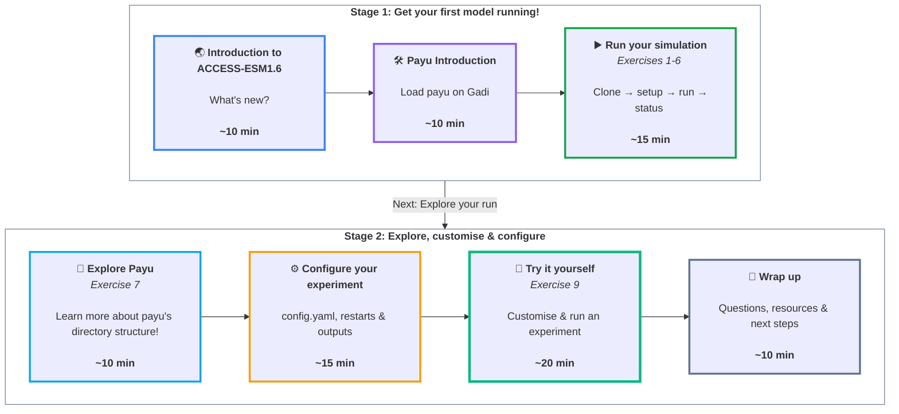

# Tutorial: Running ACCESS-ESM1.6


## Introduction

Welcome to the *How to run ACCESS-ESM1.6* training session. In this session, you'll get hands on experience of running and configuring ACCESS-ESM1.6, the recently released earth system model developed for Australia's contribution to the CMIP7 Assessment Fast Track. During this session, we'll cover:

* What ACCESS-ESM1.6 is, and how it differs to the older model ACCESS-ESM1.5
* How to clone and run ACCESS-ESM1.6 configurations using *payu* on Gadi
* Key *payu* commands and concepts for managing climate model simulations
* How to customise ESM1.6 configurations
* Where to find more information and get help


## Prerequisites
To complete the hands on sections of this tutorial, you will need to have:

- A current [NCI account](https://my.nci.org.au/mancini/signup)
- A [GitHub](https://github.com/join) account
- A MOSRS account and to have completed the [UKMO EULA signing instructions](https://forum.access-hive.org.au/t/accessing-ukmo-licensed-models/6168)
- Be a member of the NCI projects:
    - `vk83`: *Project for accessing ACCESS-NRI models*
    - `nf33`: *Project for ACCESS-NRI training events*
    - `jq44`: *Project containing released output data from ACCESS-ESM1.6 experiments*

!!! note
    If you haven't completed these prerequisites you're welcome to work with someone else for the hands on sections of the tutorial.

In addition, the following background is recommended for the hands on portions of this session:

- Some experience working on NCI will be helpful. 
- Some familiarity with git and GitHub workflows will be helpful. 
- Some familiarity with the Unix command line will be helpful. 
- Understanding of basic climate model concepts 


## Introduction to ACCESS-ESM1.6

{: class="img-contain white-background round-edges with-padding intro-img" loading="lazy"}

ACCESS-ESM1.6 is a global coupled earth system model containing active [atmosphere](https://docs.access-hive.org.au/models/model_components/atmosphere), [ocean](https://docs.access-hive.org.au/models/model_components/ocean), [sea ice](https://docs.access-hive.org.au/models/model_components/sea-ice), [land](https://docs.access-hive.org.au/models/model_components/land), and biogeochemistry components. The model supports both a prescribed CO2 concentrations mode, and a fully interactive carbon mode where carbon is coupled between the model components.

ACCESS-ESM1.6 development used [ACCESS-ESM1.5](https://www.access-nri.org.au/models/earth-system-model-esm/) as a base and brought in many significant changes. Some of the main changes are listed in the drop down below:

??? tip "Main changes"

    - A new ocean BGC model, [WOMBATlite](https://wombat-docs.readthedocs.io/stable/Model_description/WOMBATlite_model_description/).

    - The CABLE2.4 land model has been updated to CABLE3, with new features including as Australian plant types and improvements to energy and water conservation.

    - CICE4 has been replaced with [CICE5](https://github.com/ACCESS-NRI/cice5), which brings bug fixes to key diagnostics. CICE5 has been configured to use the same zero layer thermodynamics scheme.

    - An iceberg spreading scheme has been added, where meltwater from the icesheets is distributed both around the coast, and according to a wider iceberg melt pattern.

    - Released scientific configurations have been developed to match the [CMIP7 experiment protocols](https://wcrp-cmip.github.io/cmip7-guidance/docs/CMIP7/Experiment_set_up_and_Forcings), including updated atmospheric forcings.

    - Optimised for Gadi. While ESM1.6 is more computationally complex than ESM1.5, it runs roughly 25% faster.

    - Model outputs conform to the new [ACCESS-NRI data specification](https://access-output-data-specifications.readthedocs.io/en/latest/specification/), with the aim of making model output simpler to work with and to improve provenance information. Key changes include using single variable files with consistent file names for all model components, and adding provenance information into the output metadata.


In the following sections of the tutorial, we'll run our own simulations of ESM1.6 by:

1. Connecting to the NCI computer gadi and loading the simulation management software *payu*

2. Using payu to clone a released ACCESS-ESM1.6 *configuration* from GitHub

3. Using payu to run a simulation based on the configuration



While the simulations are running, we'll learn more about key _payu_ commands, how configurations are structured, and how to run a customised simulation.


## Introduction to payu

_Payu_ is a workflow manager for running numerical models in supercomputing environments. _Payu_ is designed to help users set up, run, and manage climate simulations, and provides a consistent set of commands and concepts which can be used accross several models including [ACCESS-OM3](https://docs.access-hive.org.au/models/run_a_model/run_access-om3/) and ACCESS ESM1.6.

!!! info
    For in-depth information about payu, visit the [payu documentation](https://payu.readthedocs.io/en/stable/).


## Exercise 1: Activating payu on gadi
_Payu_ is made available as a module on Gadi. To enable payu commands, log onto Gadi and run:
```
module use /g/data/vk83/modules
module load payu
```

To check that the payu module has loaded properly, we can test out running a simple command:

```
payu --version
```

This should print out the version of payu that's been loaded: `payu 1.3.4`.

## Exercise 2: Cloning an ACCESS-ESM1.6 configuration
Running a climate model requires you to collect a large number of files including:

 - model executables, 
 
 - collection of model input files such as _grids_ and _forcings_,
 
 - _configuration files_ to control the model's scientific options, and an initial state for the model to start from. 
 
 A payu *configuration* can be thought of a prebuilt bundle of all these requirements, making it easy to get a simulation running. Different scientific configurations of the model can be stored in different payu configurations.

Released ACCESS-ESM1.6 configurations are published on the [ESM1.6 configurations GitHub repository](https://github.com/ACCESS-NRI/access-esm1.6-configs), where different configurations are stored under different git branches. The branches for the ACCESS-ESM1.6 configurations which have been released by ACCESS-NRI are:

- [release-piControl](https://github.com/ACCESS-NRI/access-esm1.6-configs/tree/release-piControl): *The CO2 concentrations driven pre-industrial control*
- [release-esm-piControl](https://github.com/ACCESS-NRI/access-esm1.6-configs/tree/release-esm-piControl): *The emissions driven pre-industrial control*
- [release-historical](https://github.com/ACCESS-NRI/access-esm1.6-configs/tree/release-historical): *The CO2 concentrations driven historical configuration*
- [release-esm-historical](https://github.com/ACCESS-NRI/access-esm1.6-configs/tree/release-esm-historical): *The emissions driven historical configuration*

!!! Note
    Additional configurations, including AMIP and future scenarios, are currently being prepared for release.


The first step in running an ESM1.6 simulation is to select a configuration from the repository, and make a local copy of it on Gadi (i.e. clone). The following steps outline how to do this:


1. **Create a directory to keep your payu experiments**

    Choose a location on Gadi for storing your payu control directories. It's recommended to use a directory under $HOME, for example:

    ```
    cd ~
    mkdir ACCESS-ESM1.6
    cd ACCESS-ESM1.6
    ```

2. **Start the payu clone interactive prompt**

    Next run the `payu clone` command. This will activate an interactive prompt where we specify the configuration we want to clone, where we want to copy it to, and the name we want to use for the experiment:

    ```
    payu clone
    ```

3. **Select the GitHub repository to clone a configuration from**

    The first prompt asks for a url to the GitHub repository where we want to clone a configuration from. Here, we'll specify the ACCESS-ESM1.6 configurations repository `https://github.com/ACCESS-NRI/access-esm1.6-configs`
    ```
    >> Please enter URL of the repository, or local path of the configuration to clone:  (e.g., https://github.com/payu-org/bowl1.git, or /path/to/local/experiment; 'Tab' to browse, '/' to enter folder)  https://github.com/ACCESS-NRI/access-esm1.6-configs
    ```

4. **Select the branch from the repository you would like to clone**

    The prompt then asks if we want to clone from a branch, or a specific tag or commit in the repository. Since the released ESM1.6 configurations are stored using git branches, we'll select `An existing branch`:
    ```
    >> Payu will clone the repo based on: An existing branch
    ```

5. **Select the branch to clone**

    The next prompt asks which branch we would like to clone. You are welcome to use any of the four release configurations listed previously. For this example, I'll use the emissions driven pre-industrial control: `release-esm-piControl`
    ```
    >> Name of the branch to clone ('Tab' to browse all branches): release-esm-piControl
    ```

6. **Select a directory name for the cloned configuration**

    Next, we need to select a name for the directory that the configuration will be copied into. This directory is referred to as the *control directory*, and payu will create it for us as part of the cloning step. Any descriptive name is suitable, and here I'll use `tutorial-experiment`:
    ```
    >> Please name your local control directory:  (See 'Control directory and branch naming guidance' in the documentation.) tutorial-experiment
    ```

7. **Select whether to create a new experiment**

    The prompt asks wehether we'll be creating a new *experiment*. Select `Yes, create a new UUID as a new experiment`:
    ```
    >> Is this a new experiment? (If yes, payu will create a new branch.) Yes, create a new UUID as a new experiment
    ```

8. **Choose a name for the local branch**

    With the above choice, payu will create a new branch in the local clone of the repository to hold our experiment. Select a descriptive name, here I'll use `simulation-1`:
    ```
    >> Please name your new branch:  (Note: this won't be shared to the online repository automatically) simulation-1
    ```

9. **Select a restart**

    The next prompt asks if we want to specify a custom initial condition for the model to start from, or if we want to use the default restart files from the configuration. Select `No` to choose the default restart from the configuration.
    ```
    >> Do you want to specify a custom restart path? (If no, the default restart/initial conditions will be used.) No
    ```

10. **Select an experiment shortpath**

    The final prompt relates to the directories payu uses to organise simulation data. We'll learn more about this later in the session, but for now select `No`
    ```
    Do you want to override the shortpath? (Default is '/scratch/$PROJECT$') No
    ```


    <terminal-window>
        <terminal-line data="input">mkdir -p ~/ACCESS-ESM1.6/</terminal-line>
        <terminal-line data="input">cd ~/ACCESS-ESM1.6/</terminal-line>
        <terminal-line data="input">payu clone</terminal-line>
        <terminal-line><span class="payu-yellow">Welcome to the Payu Clone Wizard!</span></terminal-line>
        <terminal-line><span class="payu-yellow">Press 'Ctrl+C' at any time to exit.</span></terminal-line>
        <terminal-line><span class="spack-cyan">?</span> <span class="payu-red">Please enter the URL of the repository, or the local path of a configuration you want to clone:</span>  (e.g., https://github.com/payu-org/bowl1.git or /path/to/local/experiment; 'Tab' to browse, '/' to enter folder) <span class="payu-dark-yellow"> https://github.com/ACCESS-NRI/access-esm1.6-configs</span></terminal-line>
        <terminal-line><span class="spack-cyan">?</span> <span class="payu-red">Do you want to clone the repo based on:</span> <span class="payu-dark-yellow">An existing branch</span></terminal-line>
        >> Name of the branch to clone ('Tab' to browse all branches): release-esm-piControl
        <terminal-line><span class="spack-cyan">?</span> <span class="payu-red">Name of the branch to clone ('Tab' to browse all branches):</span> <span class="payu-dark-yellow">release-esm-piControl</span></terminal-line>
        <terminal-line><span class="spack-cyan">?</span> <span class="payu-red">Please name your local control directory:  (See 'Control directory and branch naming guidance' in the documentation.)</span> <span class="payu-dark-yellow">tutorial-experiment</span></terminal-line>
        <terminal-line><span class="spack-cyan">?</span> <span class="payu red">Is this a new experiment?</span> (If yes, payu will create a new branch.) <span class="payu-dark-yellow">Yes, create a new UUID as a new experiment</span></terminal-line>
        <terminal-line><span class="spack-cyan">?</span> <span class="payu-red">Please name your new branch</span>  (Note: this won't be shared to the online repository automatically) <span class="payu-dark-yellow">simulation-1</span></terminal-line>
        <terminal-line><span class="spack-cyan">?</span> <span class="payu-red">Do you want to specify a custom restart path? (If no, the default restart/initial conditions will be used.)</span> <span class="payu-dark-yellow">No</span></terminal-line>
        <terminal-line><span class="spack-cyan">?</span> <span class="payu-red">Do you want to override the shortpath? (Default is '/scratch/${PROJECT}$')</span> <span class="payu-dark-yellow">No</span></terminal-line>
        <terminal-line><span class="payu-yellow">Running command:</span></terminal-line>
        <terminal-line><span class="payu-yellow">\`payu clone -B release-esm-piControl -b simulation-1 https://github.com/ACCESS-NRI/access-esm1.6-configs tutorial-experiment`</span></terminal-line>
        <terminal-line>Cloned repository from {{github_configs}} to directory: /home/561/\$USER/ACCESS-ESM1.6/tutorial-experiment</terminal-line>
        <terminal-line>Created and checked out new branch: simulation-1</terminal-line>
        <terminal-line>laboratory path:  /scratch/\${PROJECT}/\${USER}/access-esm</terminal-line>
        <terminal-line>binary path:  /scratch/\${PROJECT}/\${USER}/access-esm/bin</terminal-line>
        <terminal-line>input path:  /scratch/\${PROJECT}/\${USER}/access-esm/input</terminal-line>
        <terminal-line>work path:  /scratch/\${PROJECT}/\${USER}/access-esm/work</terminal-line>
        <terminal-line>archive path:  /scratch/\${PROJECT}/\${USER}/access-esm/archive</terminal-line>
        <terminal-line>Updated metadata. Experiment UUID: 14058c5c-d0dd-49dd-841a-cbec42b7391e</terminal-line>
        <terminal-line>Added archive symlink to /scratch/\${PROJECT}/\${USER}/access-esm/archive/tutorial-experiment-simulation-1-14058c5c</terminal-line>
        <terminal-line>To change directory to control directory run:</terminal-line>
        <terminal-line>  cd tutorial-experiment</terminal-line>
    </terminal-window>


11. **Navigate into the control directory**

    We should now see a newly created directory which contains our cloned configuration. This is reffered to as the *control directory*:
    ```
    ls
    tutorial-experiment
    ```

    Navigate into the newly created *control directory*:

    ```
    cd tutorial-experiment
    ```

## Exercise 3: Setting project for computation and storage

By default, payu will use your currently active project on Gadi for computation and storage. To check what project you are using, you can run

```
echo $PROJECT
```

For this training session, we'll be using resources from project `nf33`. Payu allows you to select a non-default project in the `config.yaml` file, which is the main configuration file used to control a payu simulation. We'll go through more details of what you can control in the `config.yaml` file after we've set off the simulations.


To change the computation and storage project, make the following change:


```diff
# If submitting to a different project to your default, uncomment line below
# and replace PROJECT_CODE with appropriate code. This may require setting shortpath
-# project: PROJECT_CODE
+project: nf33
```

## Exercise 4: Check the configuration is properly set up
When cloning or modifying a configuration, it's recommended to first check for common errors such as inaccessible files or incorrectly configured options before running a simulation. We can do this by running the `payu setup` command, which carries out the preparation tasks involved in running a simulation, but stops just before actually starting the model. If payu notices any problems in the configuration, it will produce an error and inform the user.

Check that your configuration is properly set up and you have access to all the required files:

```
payu setup --new-uuid
```

!!! Tip
    The --new-uuid flag is only required since we changed the project settings in the `config.yaml`. If we were using our default project, we could omit the `--new-uuid` flag. Reach out to one of the ACCESS-NRI staff helping run the session for some of the details behind this.

<terminal-window>
    <terminal-line data="input">payu setup --new-uuid</terminal-line>
    <terminal-line>laboratory path: /scratch/nf33/\${USER}/access-esm</terminal-line>
    <terminal-line>binary path: /scratch/nf33/\${USER}/access-esm/bin</terminal-line>
    <terminal-line>input path: /scratch/nf33/\${USER}/access-esm/input</terminal-line>
    <terminal-line>work path: /scratch/nf33/\${USER}/access-esm/work</terminal-line>
    <terminal-line>archive path: /scratch/nf33/\${USER}/access-esm/archive</terminal-line>
    <terminal-line>Loading input manifest: manifests/input.yaml</terminal-line>
    <terminal-line>Loading restart manifest: manifests/restart.yaml</terminal-line>
    <terminal-line>Loading exe manifest: manifests/exe.yaml</terminal-line>
    <terminal-line>Setting up atmosphere</terminal-line>
    <terminal-line>Setting up ocean</terminal-line>
    <terminal-line>Setting up ice</terminal-line>
    <terminal-line>Setting up access-esm1.6</terminal-line>
    <terminal-line>Checking exe and input manifests</terminal-line>
    <terminal-line>Updating full hashes for 3 files in manifests/exe.yaml</terminal-line>
    <terminal-line>Creating restart manifest</terminal-line>
    <terminal-line>Writing manifests/restart.yaml</terminal-line>
    <terminal-line>Writing manifests/exe.yaml</terminal-line>
</terminal-window>

Once the command completes, well see a new symbolic link in the control directory pointing to a `work` directory, a temporary workspace that payu uses to run its simulations.


## Exercise 5: Running the simulation
To set off a one year simulation of your configuration, run:
```
payu run
```

??? info "Hint"
    Unfortunately, the above command will have led to the following error:
    ```
    [ERROR] Work path already exists. Please use `payu sweep` or use `payu run -f`.
    ```
    Payu will issue this error if a non-empty `work` directory for your experiment already exists, in this case because we manually ran the `payu setup` command. To get around this error, add the `-f` flag to the command:

    ```
    payu run -f
    ```
    This tells payu to delete the existing work directory and recreate it for the new simulation.


The one year simulation will take around 55 minutes to complete. The data post processing which runs in a separate job can take up to another hour, and so final outputs won't be available by the end of the session.


## Excercise 6: Check the status of your simulation
To confirm that our simulation has been sent to the PBS queue, we can use the `payu status` command. This command reports the current status of a simulation: whether it's queued, running, or in the finishing stages. It will also tell us if an experiment has crashed, which can occur for different reasons including temporary problems on Gadi,  numerical instabilities in the model, or problems with the way a configuration's been set up.

Confirm that your simulation has been sent to the PBS queue by running:

```
payu status
```
from your control directory.

While the simulations are running, we'll discuss some more features of payu and ACCESS-ESM1.6.


## Exercise 7: Understanding payu's directory structure

In this exercise, we'll learn about the directory structure that payu uses to run a simulation. We'll learn about the purposes of the *control directory*, the *archive* directory, the *work directory* and how these three relate to each other.

* The top-level directory containing the `config.yaml` file is called the *control directory*. The files in this directory and its subdirectories: `atmosphere`, `ocean`, `ice`, `coupler` are used to configure the model simulation, and we run all our payu commands (except for `payu clone`) from this directory.
* The *control directory* contains a symbolic link to the *archive directory*. This is a location on scratch where payu stores the model outputs and restart files at the end of a simulation.
* The *work directory* is a temporary workspace used to run the model. Payu collects all the model executables, input files, configuration files, and restart files into the work directory and organises them into the structure required by the model code.

For further details on the directory structure used by payu, take a look at the [how to run ESM1.6 documentation](https://docs.access-hive.org.au/models/run_a_model/run_access-esm1p6/).

In the following exerises, we'll take a look at the *work directory* being used by our currently running simulations, and we'll see how payu uses information from the *control directory* to create this temporary work space.


1. In the `config.yaml` file, you'll see lists of filepaths associated with each model component, for example:
    ```yaml

     - name: atmosphere
       model: um
       ncpus: 256
       exe: um_hg3.exe
       input:
         - /g/data/vk83/configurations/inputs/access-esm1p5/share/atmosphere/spectral/resolution_independent/2020.05.19/spec3a_sw_hadgem1_6on
         ...

     - name: ocean
       model: mom
       ncpus: 240
       exe: mom5_access_cm
       input:
         - /g/data/vk83/configurations/inputs/access-esm1p6/modern/share/ocean/biogeochemistry/global.1deg/2025.09.22/SFe_Hamiltonetal2020_monthly_clim.nc
         ...
    ```

    Take a look through the files in the `work` directory. Can you see how payu has used these paths from the `config.yaml` when constructing the work directory?
    ??? info "Hint"
         Take a look in the `work/atmosphere/INPUT` and `work/ocean/INPUT` directories. 
    


2. The above section of the config.yaml specifies names for the model executable: `exe: um_hg3.exe` and `exe: mom5_access_cm`. Can you see what payu has done with these executables when constructing the `work` directory?
    
    ??? info "Hint"
        Take a look in the `work/atmosphere` and `work/ocean` directories. 

3. Along with model executables and input files, a simulation needs configuration files which control each submodel's scientific options. For example, the `namelists` file under the `atmosphere` section of the control directory controls the atmosphere model's scientific settings. Can you see how payu has used this file when constructing the `work` directory.
   ??? info "Hint"
        Take a look in the `work/atmosphere` directory.
   

??? info "Stretch exercise"
    In the `manifests` directory, the files `input.yaml`, `exe.yaml`, and `restart.yaml` all contain lists of filepaths. How do these filepaths relate to the settings in the `config.yaml`? What do the `md5` fields contain?
    ??? info "Hint"
        The `md5` fields contain [md5 hashes](https://en.wikipedia.org/wiki/MD5) calculated for each of the hashes, and can be used to verify that input files have not been changed. Payu updates these files during the *setup* stage.


## Excercise 8: Check the status the running simulations
Our simulations should now have left the queue and started running. To check how far they've progressed, we can rerun the `payu status` command which will report the current model date.

Check where your simulation is up to by running:

```
payu status
```
agin from your control directory.

## Configuring an ESM1.6 simulation

### The `config.yaml` file
The `config.yaml` controls how payu sets up, runs, and archives a simulation. We'll only touch on a small selection of of the settings in this tutorial, but we recommend reading the [how to run ACCESS-ESM1.6 documentation](https://docs.access-hive.org.au/models/run_a_model/run_access-esm1p6/) and [payu documentation](https://payu.readthedocs.io/en/stable/config.html) for details on everything you can control from the `config.yaml` file.

#### Compute project and storage location
We've already modified our `config.yaml` file to use project `nf33` for the both the computation and storage resources. However it's common to need to use one project for computation and another for storage. To set this up, you can specify

```yaml
project: <COMPUTE PROJECT>
shortpath: /scratch/<STORAGE PROJECT>
```

#### The restart file
The following line specifies the initial restart file used in the `release-esm-piControl` experment:

```yaml
restart: /g/data/vk83/configurations/inputs/access-esm1p6/modern/pre-industrial-emissions/restart/2026.02.23
```

#### Restart pruning
By default, restart files are created at the end of each run, allowing subsequent simulations to resume from a previously saved model state. However, restart files can occupy significant disk space, and keeping all of them throughout an entire experiment is often not necessary. Payu can be configured to only keep a subset of the restarts according to a selected frequency.

The setting below tells payu to only keep every 10th year's restart files:

```yaml
restart_freq: 10YS
```

#### Syncing model outputs
The `archive` directory is typically under the `/scratch` storage on Gadi, where files are regularly deleted once they have not been accessed for a period of time. It's common to copy a simulations outputs over to a location on `/g/data` to preserve them while doing analysis.

Rather than copying the outputs manually, you can use the `sync` settings to get payu to automatically sync the outputs and restart files to a specified location at the end of each run segment.

For example, the following changes will sync the archived data to a location on `/g/data/nf33/`

```diff
# Sync options for automatically copying data from ephemeral scratch space to
# longer term storage
sync:
-   enable: False # set path below and change to true
+   enable: True
    restarts: True
-   base_path: null # Set to location on /g/data (e.g., /g/data/$PROJECT/$USER/)
+   base_path: /g/data/nf33/<user>/tutorial_experiments/

```


### Configuring individual submodels

Configuration files for each of ESM1.6's submodels can be found in the `ocean`, `atmosphere`, `ice` and `coupler` directories within the control directory.

Customising the configuring components usually requires in-depth knowledge of the components, and the [Hive Forum](https://forum.access-hive.org.au/) can be a good place to seek advice fromt the wider community and ACCESS-NRI staff.


## Exercise 9: Running a custom configuration
In this exercise, we'll get some practice using the settings described above. We'll clone and run another configuration and customise it to use a different restart file, to activate syncing, and to modify the scientific configuration for the atmosphere submodel.

A selection of restart files from the ESM1.6 CMIP7 piControl experiment are available in <!--TODO: fill in location--> LOCATION ON JQ44.

1. Clone the `release-piControl` configuration into a new control directory named `tutorial-custom` located under `~/ACCESS-ESM1.6`. Remember to set the compute project to `nf33`
2. Set your experiment to use a selected restart from the above location. You can set this either during the `payu clone` command, or by editing the `config.yaml` file after the cloning step.
3. Modify the `config.yaml` to enable the output syncing. Configure payu to sync the model outputs and restarts to `/g/data/nf33/<user>/tutorial_experiments`, where `<user>` is your gadi username.
4. The `release-piControl` configuration prescribes an atmospheric CO2 mass mixing ratio (MMR) of 4.3189e-04. This value is controlled by the `CO2_MMR` setitng in the `namelists` file under the atmosphere directory. Find where this is set, and change it to a value of your choice (For example 8.6378e-04 for doubled CO2). 
5. Setup and run your simulation – check back tomorrow and if everything has worked you should find a copy of your outputs in `/g/data/nf33/<user>/tutorial_experiments`.


## Further resources and getting help

This session has been a brief introduction to running ACCESS-ESM1.6 with payu. We've only had time to introduce the basics, and you may be interested to learn more about creating custom ESM1.6 configurations and more advanced payu features, including:

- Customising submodel configurations
- Modifying model source code and building your own executables
- Controlling model output variables
- Sharing payu experiments with git and GitHub
- Advanced experiment workflows with payu


For details these topics, you can refer to:

- The [*How to run ACCESS-ESM1.6* documentation page](https://docs.access-hive.org.au/models/run_a_model/run_access-esm1p6/)
- The [ACCESS-ESM1.6 configuration docs](https://access-esm1p6-configs.access-hive.org.au/)
- The [payu documentation](https://payu.readthedocs.io/en/stable/)
- For information on the model's scientific configuration, there will be a model description paper published in the future.


ACCESS-NRI staff are also available to answer your questions on the [ACCESS-Hive Forum](https://forum.access-hive.org.au/). If you have any questions related to ACCESS-ESM1.6, you are welcome to add a help request on the Forum.


## Extension sections
The following sections are included as extensions for those who are familiar with running climate simulations with payu, and have already completed the main portion of the tutorial. These sections provide more information on the new ACCESS-NRI data specifications and the structure of ESM1.6's outputs, and introduce some of payu's advanced provenance features.


### ACCESS-ESM1.6 outputs and the ACCESS-NRI data spec
ACCESS-ESM1.6 is the first model whose outputs adhere to the new ACCESS-NRI data specifications. The goal of these specifications is to ensure that  model output from different ACCESS models have both consistent structure and metadata, and to improve ease of use for working with the data.

Key changes in ACCESS-ESM1.6's output data compared to ESM1.5 include:

- Single variable files are produced for all three model components.
- Outputs for all model components follow a consistent naming scheme, with core metadata embedded in the names. For example:
    - **ocean**: `access-esm1p6.mom5.2d.psiu.1mon.mean.1850.nc`
    - **atmosphere**: `access-esm1p6.um7p3.2d.fld_s03i237.1mon.mean.1850.nc`
    - **ice**:  `access-esm1p6.cice5.3d.siitdconc.1mon.mean.1850.nc`
- Consistent provenance data is added to the netCDF global attributes:
    ```
    :base_configuration = "dev-preindustrial+concentrations" ;
    :contact = "<email-address>" ;
    :Conventions = "CF-1.11,ACDD-1.3" ;
    :data_specification = "ACCESS-Output Data Specification v0.1.0-alpha" ;
    :date_created = "2026-08-11T02:21:26Z" ;
    :date_metadata_modified = "2026-08-11T02:22:15Z" ;
    :date_modified = "2026-08-11T02:22:15Z" ;
    :experiment_repo = "https://github.com/ACCESS-NRI/access-esm1.6-configs" ;
    :experiment_uuid = "0dab21b3-892f-41dd-afb4-21198a7ef648" ;
    ```

Take a look at the output in <!--TODO put some output somewhere accessible--> DIRECTORY to see how the model output data is structured, and feel free to raise any questions with NRI staff. See [the data specifications documentation](https://access-output-data-specifications.readthedocs.io/en/latest/specification/) for further details on the ACCES-NRI data specifications.


### Exercise 9: Runlogs, manifests, and experiment provinence
A core principle of payu's design is to make experiment provenance easy. Payu automatically tracks configuration settings, input, restart, and executable paths throughout an experiment, recording this information with git.

This information can be used in many different ways, an example of which we'll see in the (made up) example of below:


*I've been running a historical simulation using a custom volcanic forcing input file `volcts_cmip7.dat`. I inadvertently modified the file part way through the experiment, and will need to rerun the the years after it changed. Unfortunately, I don't know when during the simulation the input file changed.*

*Using either the output directories in `/g/data/nf33/sw6175/runlogs-exercise/custom_volcanic-custom-volcanic-5a0df8c5`, or the published experiment repository in https://github.com/blimlim/runlog_example, can you work out at which point the volcanic forcing file changed?*,

*Hint: Take a look at the files found in the manifest directories.*


!!! note
    While this example is a little contrived (payu will guard against changes to the input files when the `manifest: reproduce: input: true` option is included in the `config.yaml`), there have been several times during the development of ESM1.6 where the experiment runlogs have been helpful for investigating similar issues. 


