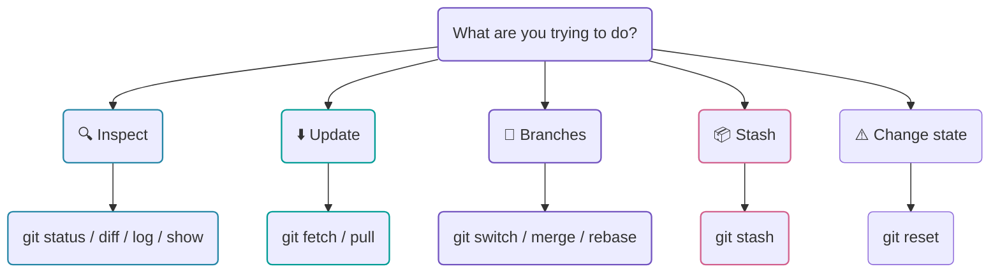
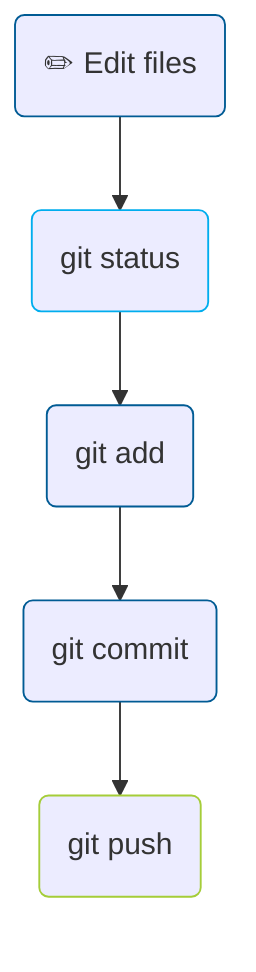
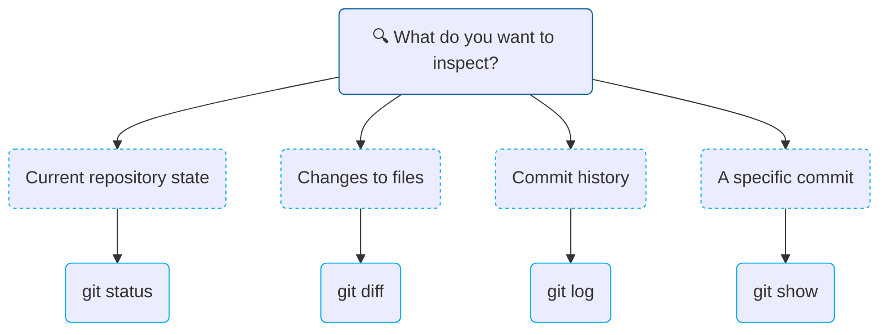
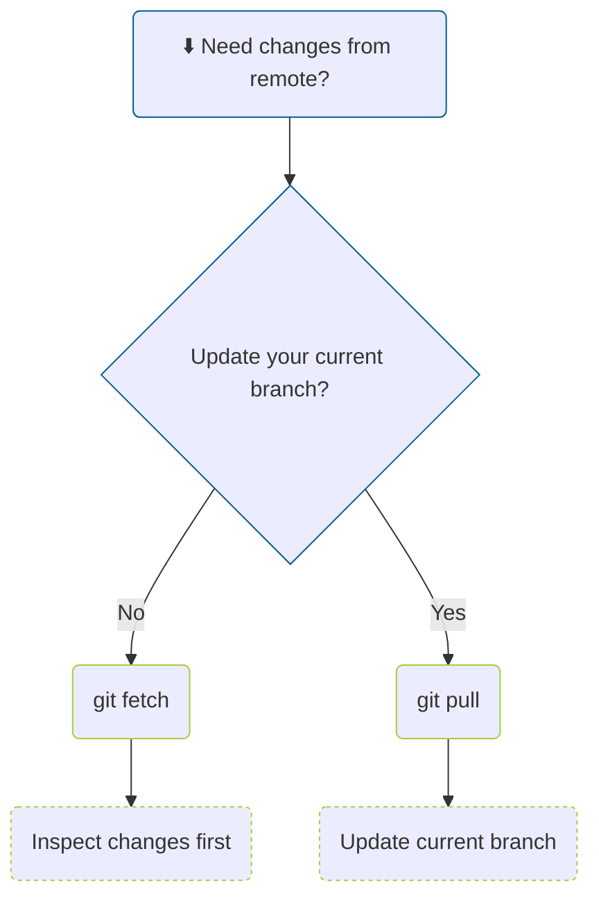
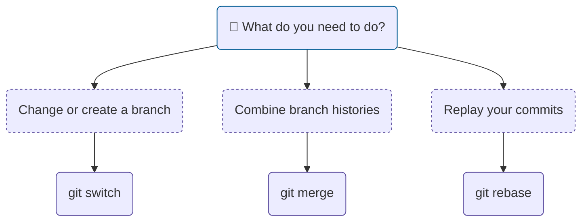
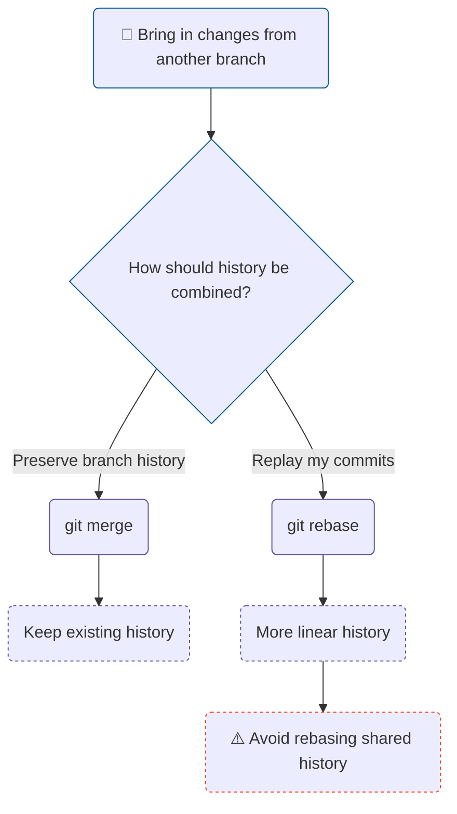
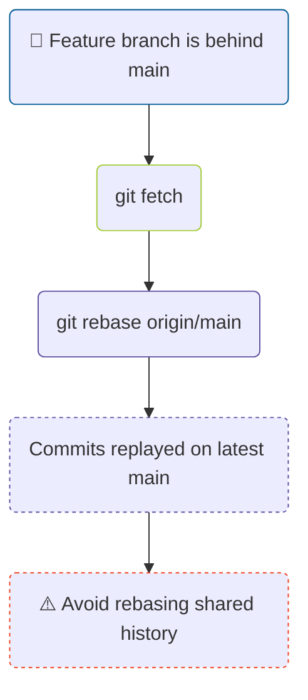
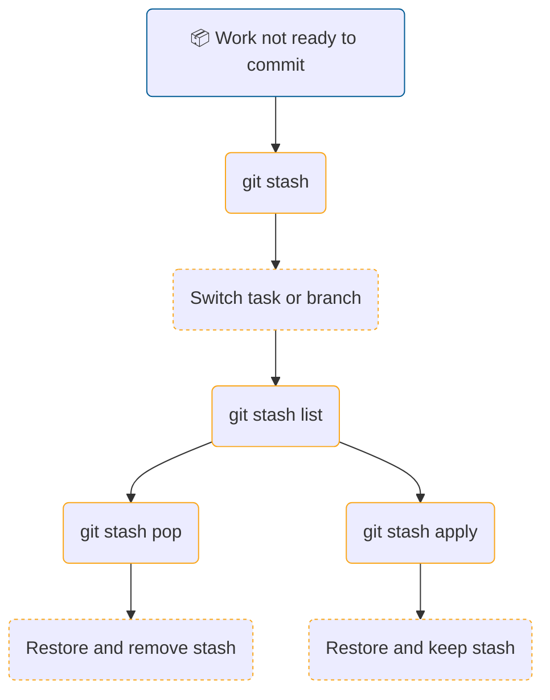
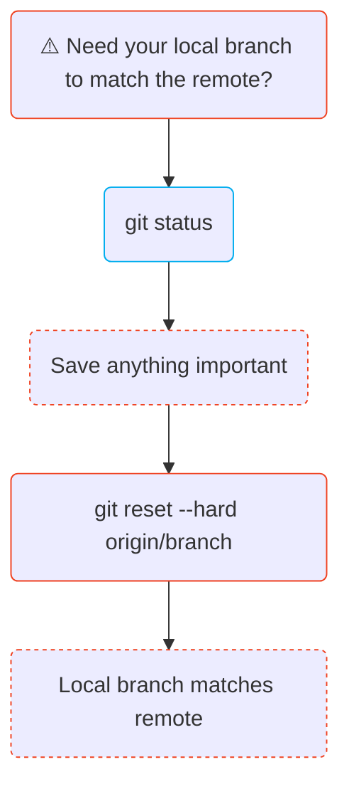

# Working with Git

Git is used across the ACCESS community for model configurations, software, and documentation. This tutorial aims to provide a practical reference for Git users for day-to-day development workflows. 

It is intended for anyone who has used Git before but may occasionally need a reminder of what to do next. 

<!-- 
TODO
Mermaid diagrams with hyperlinks to each of the sections.  
The hyperlinks are currently broken, need to fix. 
The intention is not to have too many confusing flowcharts, but instead
include a few useful ones so that the commands and their use casees
are easier to remember visually.
-->

## What are you trying to do


## The everyday git cycle


## Inspect your work


## Fetch or pull?


## Work with branches


## Merge or rebase


## Git rebase 


## Git stash 


## Git reset



---

<!-- 
TODO
Please note the markdown below is pasted from SharePoint Document. 
Changes needed to adjust the language and flow of the page.
-->
## Introduction (Jasmeen)

This article provides a practical reference for Git users for day-to-day development workflows, including working with ACCESS-NRI repositories.
It is not intended as a beginner introduction to Git. You can use this page as a quick reminder when you need to:

- work with local and remote branches;
- keep your branch up to date;
- temporarily put unfinished changes aside;
- inspect commits and changes;
- compare different versions of files; or
- reorganise or combine Git history.

```
Question: Add who is this document for?
```

!!! note
    The examples below use generic branch names such as `main` and `feature-branch`. Replace these with the branch names used in your repository.
!!! note: [<argument>] mean optional argument.

**CONCISE!! for the whole document**


** facing people with 10% git knowledge **

## Basic git commands (Qianhui)

A line to explain what is this table. For example, _here are a few core Git commands that are useful to keep handy in everyday Git workflows. For more details, please refer to the link in the command._

| Command | Basic Usage | Meaning |
|---|---|---|
| [git clone](https://git-scm.com/docs/git-clone) | `git clone <url> <local_dir>` | Clone a remote repository to the local directory|
| [git branch](https://git-scm.com/docs/git-branch) | `git branch -a` | List all branches |
| [git status](https://git-scm.com/docs/git-status) | `git status` | Show status of current working tree. |
| [git add](https://git-scm.com/docs/git-add) | `git add <file>` | Stage changes for commit. |
| [git commit](https://git-scm.com/docs/git-commit) | `git commit -m "<message>"` | Save staged changes as a new commit. |
| [git push](https://git-scm.com/docs/git-push) | `git push` | Push local commits to the remote repository. |

## Git fetch and git pull (Paul) (Split into two headings)

The `git fetch` and `git pull` commands are related but very different: `git fetch` updates your remote tracking branches, while `git pull` does that *and* updates the local branch in your current workspace to match the remote.

### When to use

At the beginning of your work and before switching branches.

Use `git fetch`:
1. To update remote tracking branches when your workspace has uncommitted changes that you don't want to disturb or `stash`.
2. To update remote tracking branches when your local repository clone has become stale.

Use `git pull`:
1. To update the local branch in your current workspace when the branch is clean and there are no uncommitted changes and no potential merge conflicts from the remote tracking branch.
2. To update the local branch when you are prepared to deal with merge conflicts coming from the remote tracking branch.

### Recommended usage (as climate modelling?)

To use `git fetch`:
The command is
```
git fetch
```
(assuming that you have only one *remote*). The full command uses an optional *remote* and an optional *branch*, e.g.:
```
git fetch origin main
```
```
git fetch -bP
```

To use `git pull`:
Make sure that your current local branch is the one that you want to update. Then run
```
git pull
```
Warning: This can trigger a `git merge` if the remote and local branches have different commits. You might instead want to consider using
```
git pull --rebase
```
instead. See `git merge` and `git rebase` here for more details. The full command also uses an optional *remote* and an optional *branch*, e.g.:
```
git pull origin main
```

## Git switch (Qianhui)

Git switch allows us to switch the `HEAD` to a different branch.

### When to use

- To create a new branch.
- To switch to an existing branch, either local or remote.


### How to use

#### 1. Create a new branch

To create a new branch that doesn't exist locally or on the remote repository:
```
git switch -c <new_branch_name> [<source_branch>]
```

This creates the new branch and switches to it.

#### 2. Switch to an exiting branch

To switch to a branch that already exists locally, simply use:
```
git switch <existing_branch>
```

If this branch only exist on the remote directory but not locally, please use:
```
git switch --track origin/<existing_branch>
```

## Git merge (Jasmeen) (Might need to be modified as git pull)
`git merge` combines the histories of two branches. If the branches have diverged, Git will usually create a merge commit that keeps the history of both branches.

### When to use

- To combine completed work from another branch.
- When preserving the existing branch history is useful.
- When working on a shared branch where rewriting existing commits should be avoided.

### How to use
First, switch to the branch that should receive the changes:

```git switch <target-branch>```

Then merge the other branch:

```git merge <branch-to-merge>```

For example:

```git switch main```

```git merge feature-branch```

If Git cannot combine the changes automatically, it will report a merge conflict. Resolve the conflicting files, stage them, and complete the merge:

```git add <resolved-file>```

```git commit```

## Git rebase (Jasmeen)

`git rebase` moves your branch commits so they are replayed on top of another branch. This can create a cleaner, more linear history.

A common workflow is to update a feature branch with the latest changes from `main`:

`git switch feature-branch`

`git fetch origin`

`git rebase origin/main`

Conceptually, this changes a history like:

### When to use
- To update a feature branch with recent changes from another branch.
- To keep feature branch history relatively linear.
- To tidy local work before it is merged.

### Resolving rebase conflicts
If Git finds a conflict during the rebase, resolve the affected files and stage them:

`git add <resolved-file>`

Then continue:

`git rebase --continue`

To cancel the rebase and return to the state before it started:

`git rebase --abort`

_**Important note**: Rebase rewrites commit history, so avoid rebasing commits that other people are already working from on a shared branch.
For your own feature branch, rebasing before opening or updating a pull request can be useful for incorporating recent upstream changes while keeping the history straightforward._

## Git stash (Qianhui)

Git stash works as a temporary save button. It lets us save changes that we are not ready to commit, so we can temporarily switch to other work without committing unfinished changes to the Git history.

### When to use

- If working on one branch and needing to switch to another branch.
- To pull updates from the remote repository, when local changes are not ready to commit.
- If working on the wrong branch, to move those changes to the correct branch.

### How to use

#### 1. Save changes
To save our current changes in the stash, with a message to help us remember what they are:
```
git stash push -m "Message for myself"
```
Think of this as putting our changes into a virtual drawer and leaving a sticky note on it. 
By default, `git stash` saves changes to tracked files that are modified or deleted. 
Untracked files are not included unless we explicitly ask Git to include them.

#### 2. List stashes
To see all the stashes you have created:
```
git stash list
```
We may see something like:
```
stash@{0}: On main: WIP: fix restart handling
stash@{1}: On dev: update documentation
```

To check the content of one specific stash, for example, `{0}`:
```
git stash show -p stash@{0}
```

#### 3. Apply a stash

To bring the changes from the most recent stash onto our current branch:
```
git stash pop
```
or
```
git stash apply
```
The later command leave a copy in the stash.


#### 4. Clean up stash 
To delete a specific stash:
```
git stash drop stash@{0}
```
Or to clean up all stashes:
```
git stash clear
```


## Git reset (Harshula)

Use `git reset` to modify the state of a branch. Refer to the manual page for details: https://git-scm.com/docs/git-reset

e.g., `git reset --hard origin/<branch>` is a useful command to reset the local branch to match the remote branch.


## Git log (Harshula)

Use `git log` to see the history of the repository. Refer to the manual page for details: https://git-scm.com/docs/git-log

e.g., `git log -c` provides the output of `git log` mixed with the code changes.

## Git show (Davide)

The `git show` command lets you look into specific Git objects, usually one commit.

### When to use

- You already know the commit you care about and want to see its message, metadata and diff in one shot.
- You want to see what a specific file looked like at a specific past commit.
- You want to double-check a tag's message and what commit it points to.

### How to use
```
git show <commit>
```

Running only `git show` will display details about the most recent commit.

`<commit>` can be any Git reference (e.g., commit hash, branch name, tag, references like `HEAD~2`, etc.).

You can also specify a single file after the Git reference, to see that file's version at that point in time:
```
git show <commit>:<file-path>
```

## Git diff (Harshula)

Use `git diff` to visualise source code differences. Refer to the manual page for details: https://git-scm.com/docs/git-diff

e.g., `git diff origin/<branch>` is a useful command to see the difference between the local branch and the remote branch. A good step before pushing the local branch to the remote branch.

e.g., `git difftool -y --tool=meld` is a useful command to display the diff in the graphical diff program `meld`. Another diff program be used by replacing `meld` with the name of the executable.


_Last updated: YYYY-MM-DD_

---

!!! note "Todos"
    Have a export to pdf option to people to save it locally somewhere on this page.

!!! note "Todos"
    Point the beginners to the beginner guide for git. Include a good beginner's guide link at the top. 

    | Audience | Role of this page |
    |---|---|
    | Completely new to Git | Point them to a beginner tutorial |
    | **Occasional / early-intermediate Git user** | **Primary audience** |
    | Regular contributor | Quick refresher / decision reference |
    | Advanced Git user | Link to official Git documentation rather than duplicating it |
    